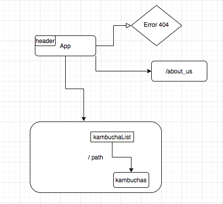

# _Ganesha Kombucha_

#### _This is an application for a kombucha shop that has pages and routes for showing a list of kombuchas, adding kombuchas, editing kombuchas, and learning about the company._

#### By _**Josh Forman**_

## Description

_This is an application for a kombucha shop that has pages and routes for showing a list of kombuchas, adding kombuchas, editing kombuchas, and learning about the company._

_https://github.com/JPForman/Ganesha-Kambucha.git_

## Specs

* _The application allows the user to view, update, and create kambucha kegs._

## Routes

made at https://www.draw.io/

## Setup/Installation Requirements

* _Clone repository from git hub_

* _cd into directory root_

* _$ npm install_

* _$ npm run start (browser will open to localhost:3000_

## Known Bugs

_Needs creation an updating functionality_

_Needs about me stubs_

_Needs styling_

## Support and contact details

_Any questions, comments or contributions please contact Josh Forman (cyborgforman@gmail.com)_

## Technologies Used

_React, Webpack_

### License

*The MIT License

Permission is hereby granted, free of charge, to any person obtaining a copy
of this software and associated documentation files (the "Software"), to deal
in the Software without restriction, including without limitation the rights
to use, copy, modify, merge, publish, distribute, sublicense, and/or sell
copies of the Software, and to permit persons to whom the Software is
furnished to do so, subject to the following conditions:

The above copyright notice and this permission notice shall be included in
all copies or substantial portions of the Software.

THE SOFTWARE IS PROVIDED "AS IS", WITHOUT WARRANTY OF ANY KIND, EXPRESS OR
IMPLIED, INCLUDING BUT NOT LIMITED TO THE WARRANTIES OF MERCHANTABILITY,
FITNESS FOR A PARTICULAR PURPOSE AND NONINFRINGEMENT. IN NO EVENT SHALL THE
AUTHORS OR COPYRIGHT HOLDERS BE LIABLE FOR ANY CLAIM, DAMAGES OR OTHER
LIABILITY, WHETHER IN AN ACTION OF CONTRACT, TORT OR OTHERWISE, ARISING FROM,
OUT OF OR IN CONNECTION WITH THE SOFTWARE OR THE USE OR OTHER DEALINGS IN
THE SOFTWARE.*

Copyright (c) 2020 **_Josh Forman_**
